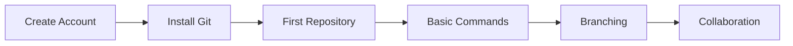

# 🚀 GitHub Beginner Guide

<div align="center">


### A Complete Guide for GitHub Beginners

*Master GitHub from basics to advanced techniques with comprehensive tutorials, tips, tricks, and keyboard shortcuts*

[Getting Started](#-getting-started) •
[Documentation](#-documentation) •
[Quick Reference](#-quick-reference) •
[Resources](#-resources)

</div>

---

## 📚 About This Repository

Welcome to the **GitHub Beginner Guide**! This comprehensive resource is designed to help you master GitHub from the ground up. Whether you're a complete beginner or looking to level up your skills, you'll find everything you need here.

### What You'll Learn

✅ **GitHub Fundamentals** - Understanding repositories, commits, branches, and more  
✅ **Git Basics** - Essential commands and workflows  
✅ **Keyboard Shortcuts** - Speed up your workflow significantly  
✅ **Tips & Tricks** - Pro techniques used by senior developers  
✅ **Best Practices** - Industry-standard approaches to version control  
✅ **Collaboration** - Working effectively with teams  
✅ **Advanced Features** - Actions, Projects, and automation

---

## 📝 Documentation

Our documentation is organized into clear, digestible sections:

### Core Guides

| Guide | Description | Status |
|-------|-------------|--------|
| [**01 - Getting Started**](./docs/01-getting-started.md) | Complete setup guide, account creation, Git installation, and first repository | ✅ Complete |
| [**02 - Keyboard Shortcuts**](./docs/02-keyboard-shortcuts.md) | Comprehensive keyboard shortcuts for lightning-fast GitHub navigation | ✅ Complete |
| [**03 - Tips & Tricks**](./docs/03-tips-and-tricks.md) | Advanced techniques and productivity hacks | 🚧 Coming Soon |
| [**04 - Best Practices**](./docs/04-best-practices.md) | Industry-standard workflows and conventions | 🚧 Coming Soon |
| [**05 - Collaboration**](./docs/05-collaboration.md) | Pull requests, code reviews, and team workflows | 🚧 Coming Soon |

### Additional Resources

- **Cheat Sheets** - Quick reference cards for common tasks
- **Troubleshooting** - Common issues and their solutions
- **Advanced Topics** - CI/CD, GitHub Actions, and automation
- **Video Tutorials** - Visual learning resources

---

## 🚀 Getting Started

### Quick Start (5 Minutes)

```bash
# 1. Install Git
winget install Git.Git  # Windows
brew install git        # macOS
sudo apt install git    # Linux

# 2. Configure Git
git config --global user.name "Your Name"
git config --global user.email "your.email@example.com"

# 3. Clone this repository
git clone https://github.com/girishlade111/Github-Beginner-Guide.git

# 4. Start learning!
cd Github-Beginner-Guide
```

### Your First GitHub Workflow

1. ⭐ **Star this repository** to bookmark it
2. 📖 **Read the [Getting Started Guide](./docs/01-getting-started.md)**
3. ⌨️ **Master [Keyboard Shortcuts](./docs/02-keyboard-shortcuts.md)**
4. 💻 **Practice with real projects**
5. 👥 **Contribute to open source**

---

## ⚡ Quick Reference

### Essential Git Commands

```bash
# Repository Setup
git init                 # Initialize a new repository
git clone <url>         # Clone a repository

# Basic Workflow
git status              # Check status
git add .               # Stage all changes
git commit -m "message" # Commit changes
git push                # Push to remote
git pull                # Pull from remote

# Branching
git branch              # List branches
git checkout -b <name>  # Create and switch to branch
git merge <branch>      # Merge branch
```

### Top 10 Keyboard Shortcuts

| Shortcut | Action |
|----------|--------|
| `?` | Show keyboard shortcuts |
| `s` or `/` | Focus search |
| `g` `n` | Go to notifications |
| `g` `c` | Go to code |
| `g` `i` | Go to issues |
| `g` `p` | Go to pull requests |
| `t` | File finder |
| `.` | Open in web editor |
| `b` | Open blame view |
| `l` | Jump to line |

---

## 📚 Repository Structure

```
Github-Beginner-Guide/
│
├── docs/                    # Documentation files
│   ├── 01-getting-started.md
│   ├── 02-keyboard-shortcuts.md
│   ├── 03-tips-and-tricks.md
│   ├── 04-best-practices.md
│   └── 05-collaboration.md
│
├── assets/                  # Images and resources
│   ├── screenshots/
│   └── diagrams/
│
├── cheatsheets/             # Quick reference guides
│   ├── git-commands.md
│   ├── github-shortcuts.md
│   └── markdown-syntax.md
│
├── README.md                # This file
├── LICENSE                  # MIT License
└── CONTRIBUTING.md          # Contribution guidelines
```

---

## 🎯 Learning Path

### For Complete Beginners



**Week 1:** Account setup and basic concepts  
**Week 2:** Git fundamentals and local repositories  
**Week 3:** Remote repositories and GitHub features  
**Week 4:** Collaboration and pull requests

### For Intermediate Users

- Master keyboard shortcuts
- Learn advanced Git commands
- Explore GitHub Actions
- Contribute to open source projects

### For Advanced Users

- Set up CI/CD pipelines
- Implement custom workflows
- Manage large-scale projects
- Mentor and code review

---

## 🛠️ Tools & Extensions

### Recommended Browser Extensions

- **[Octotree](https://www.octotree.io/)** - File tree navigation
- **[Refined GitHub](https://github.com/refined-github/refined-github)** - Enhanced GitHub UI
- **[GitHub Hovercard](https://github.com/Justineo/github-hovercard)** - Quick user/repo info
- **[OctoLinker](https://octolinker.now.sh/)** - Navigate dependencies

### CLI Tools

```bash
# GitHub CLI
gh repo view
gh pr create
gh issue list

# Git Aliases (add to .gitconfig)
git config --global alias.st status
git config --global alias.co checkout
git config --global alias.br branch
```

---

## 🎓 Practice Projects

### Beginner Projects

1. **Personal Portfolio** - Create and host your portfolio on GitHub Pages
2. **Todo App** - Build a simple todo application with version control
3. **Documentation Site** - Practice Markdown and GitHub features

### Intermediate Projects

1. **Open Source Contribution** - Find and contribute to projects
2. **Team Project** - Collaborate with others using branches and PRs
3. **Automated Workflow** - Set up GitHub Actions for your project

---

## 👥 Contributing

We welcome contributions! Here's how you can help:

1. 🐛 **Report bugs** - Open an issue
2. 💡 **Suggest features** - Share your ideas
3. 📝 **Improve documentation** - Fix typos, add examples
4. ✨ **Add new guides** - Share your knowledge

See [CONTRIBUTING.md](CONTRIBUTING.md) for detailed guidelines.

---

## 💬 Community & Support

- ❓ **Questions?** Open a [Discussion](../../discussions)
- 🐛 **Found a bug?** Create an [Issue](../../issues)
- 💬 **Want to chat?** Join our [Discord](#) (Coming soon)
- 🐦 **Follow us** on Twitter [@githubguide](#) (Coming soon)

---

## 📚 Additional Resources

### Official Documentation

- [GitHub Docs](https://docs.github.com)
- [Git Documentation](https://git-scm.com/doc)
- [GitHub Skills](https://skills.github.com/)

### Interactive Learning

- [GitHub Learning Lab](https://lab.github.com/)
- [Learn Git Branching](https://learngitbranching.js.org/)
- [Git Immersion](http://gitimmersion.com/)

### Books & Guides

- [Pro Git Book](https://git-scm.com/book) (Free)
- [GitHub Guides](https://guides.github.com/)
- [Git Cheat Sheet](https://education.github.com/git-cheat-sheet-education.pdf)

### Video Tutorials

- [GitHub Training](https://www.youtube.com/githubguides)
- [Git & GitHub Crash Course](https://www.youtube.com/)
- [Advanced Git Tutorials](https://www.youtube.com/)

---

## 🏆 Acknowledgments

This guide is built on the collective knowledge of the developer community. Special thanks to:

- GitHub Education for their excellent resources
- The open-source community for continuous inspiration
- All contributors who help improve this guide

---

## 📜 License

This project is licensed under the MIT License - see the [LICENSE](LICENSE) file for details.

---

## ⭐ Stars and Forks

If you find this guide helpful, please consider:

- ⭐ **Starring** this repository
- 🍴 **Forking** it to customize for your needs
- 👥 **Sharing** it with others who are learning
- 📣 **Following** for updates

---

<div align="center">

### Happy Learning! 🎉

*Made with ❤️ by developers, for developers*

[Back to Top](#-github-beginner-guide)

</div>

---

## 📅 Changelog

### Version 1.0.0 (October 2025)
- ✅ Initial release
- ✅ Getting Started guide
- ✅ Comprehensive keyboard shortcuts
- 🚧 Tips & tricks (coming soon)
- 🚧 Best practices (coming soon)
- 🚧 Collaboration guide (coming soon)

---

**Last Updated:** October 7, 2025  
**Maintainer:** [@girishlade111](https://github.com/girishlade111)  
**Status:** 🟢 Active Development

---

**Built by Girish Lade** — https://ladestack.in
